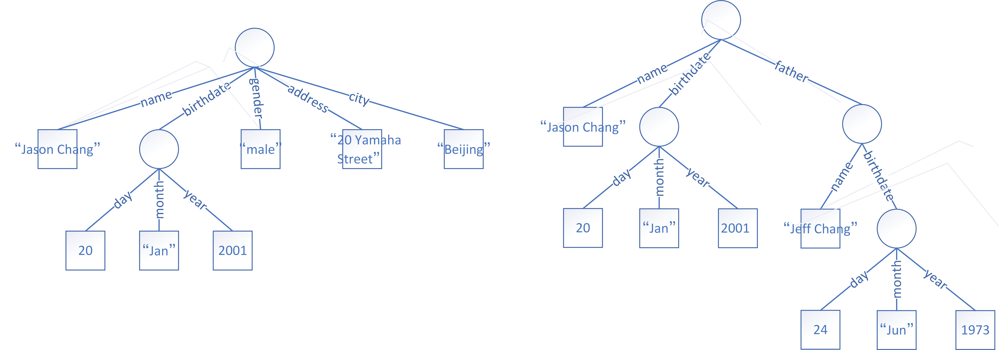

# 文档模型

## 文档结构

我们首先进入文档数据库的世界。凡是将文档模型作为数据模型的数据管理系统，我们统称为文档数据库系统。顾名思义，文档模型就是将数据组织成一个个的文档。每个文档通常表示现实世界中的一个对象或实体。刚接触文档模型的读者可能会对“文档”这个词很费解，因为它跟我们通常说的文本或文章并不属同一概念。文档模型中的文档特指如下的数据组织方式：

```bson
{
  "name": "Jason Chang",
  "birthdate": "Jan 20, 2001",
  "gender": "male",
  "address": "20 Yamaha Street",
  "city": "Beijing"
}

{
  "name": "Jessie Li",
  "birthdate": "Dec 4, 1992",
  "gender": "female",
  "address": "200 Sichuan Street",
  "city": "Shanghai"
}
```

这里，我们使用了文档模型对上一章提到的两个人（Jason Chang和Jessie Li）进行了描述，得到了两个文档。熟悉Javascript或者Web编程的朋友可能会很快反应过来：这不就是JSON（JavaScript Object Notation）文件吗？没错。JSON正是使用文档模型对数据进行组织的。在文档模型中，一个实体或对象的描述被放置在一对花括号“{”、“}”之中。花括号"{}"和描述内容则构成了一个文档。其中，描述内容为多个属性和属性值的集合。比如，关于Jason Chang的文档由姓名（name）、生日（birthdate）、性别（gender）、住址（address）、城市（city）五个属性组成。每个属性都有一个取值。其中，name属性上的取值为“Jason Chang”，birthdate属性上的取值为“Jan 20, 2001”。

属性值的数据类型通常为字符串，如上述例子中的“Jason Chang”、“20 Yamaha Street”等，但也可以是其他的数据类型，比如数字、布尔值、日期等等。如下所示：

```bson
{"x": 2001}       //整数
{"x": 3.14}       //浮点数
{"x": true}       //布尔值
{"x": Date("1988-01-09")}       //日期
```

此外，属性的取值除了是单个值之外，还可以是其他的文档，从而形成**嵌套文档**结构，如下面的例子所示：

```bson
{
  "name": "Jason Chang",
  "birthdate": {
    "day":20,
    "month":"Jan",
    "year":2001
  },
  "gender": "male",
  "address": "20 Yamaha Street",
  "city": "Beijing"
}
```

这里，birthdate的属性值不再是一个字符串，而是一个文档对象，称为子文档。实际上，子文档里面还可以包含子文档。这样的嵌套可以无限进行下去，如下面的例子所示：

```bson
{
  "name": "Jason Chang",
  "birthdate": {
    "day":20,
    "month":"Jan",
    "year":2001
  },
  "father": {
    "name": "Jeff Chang",
    "birthdate": {
      "day":24,
      "month":"Jun",
      "year":1973
    }
  }
}
```

考虑嵌套之后，文档的结构就变成了树形结构。图2.1展示了上述两个文档的树形结构。在这个结构中，树的根节点代表文档自身，叶子节点代表属性值，中间节点则代表子文档。

<!-- -->

<center>
	
	<br>
	<div display: inline-block; padding : 2px>
		图 2.1 文档的树形结构
	</div>
</center>

除了单个值和子文档，属性值还可以是数组的形式。例如，如果Jason Chang有三个email地址，我们就可以将它们放进一个数组里。

```bson
{
  "name": "Jason Chang",
  "address": "20 Yamaha Street",
  "city": "Beijing",
  "email": ["jason.chang@gmail.com", "jchang@163.com", "jasonchang@qq.com"]
}
```

数组里的元素除了是数值类型、字符串类型，也可以是子文档，如下例所示。有了数组之后，文档的结构仍然是树形结构。

```bson
{
  "name": "Jeff Chang",
  "birthdate": "Jun 24, 973",
  "gender": "male",
  "children": [
    {
      "name": "Jason Chang",
      "birthdate": "Jan 20, 2001",
      "gender": "male",
    },
    {
      "name": "Cindy Chang",
      "birthdate": "Sep 3, 2005",
      "gender": "female",
    }
  ]
}
```

在文档数据库中，文档的内容可能出现重复，以至于两个文档的属性和属性取值完全相同。为了更好地区分文档，数据管理系统通常使用一个称为“ID”的属性作为文档的标识，并确保所有文档的ID都是不同的。这样，用户可以通过ID来唯一地识别一个文档。如下例所示，ID属性取值采用的是12 bytes组成的ObjectID数据类型。ID属性通常是隐藏的，在需要时可以显示出来。

```bson
{
  "_id": ObjectId("5037ee4a1084eb3ffeef7228"),
  "name": "Jason Chang",
  "birthdate": "Jan 20, 2001",
  "gender": "male",
  "address": "20 Yamaha Street",
  "city": "Beijing"
}

{
  "_id": ObjectId("4b2b9f67a1f631733d917a7a"),
  "x": 3.14
}
```

## 文档的匹配

文档模型是一种数据组织结构，也是人和计算机表达信息的一种共同方式。有了这种共同的表达方式，人和计算机可以对数据达成一致的理解。除了一个统一的信息表达方式，我们还需要一种统一的计算方式，用于描述数据的存取功能。文档模型上最常用的计算方式称为文档匹配。接下来，我们将描述文档是如何进行匹配的。

回到最初的例子，假设数据库里有描述Jason Chang和Jessie Li的两个文档：

```bson
{
  "name": "Jason Chang",
  "birthdate": {
    "day":20,
    "month":"Jan",
    "year":2001
  },
  "gender": "male",
  "address": "20 Yamaha Street",
  "city": "Beijing"
}

{
  "name": "Jessie Li",
   "birthdate": {
    "day":4,
    "month":"Dec",
    "year":1992
  },
  "gender": "female",
  "address": "200 Sichuan Street",
  "city": "Shanghai"
}
```

那么，下面这个文档能够和上面的哪个文档实现匹配呢？

```bson
{
  "gender": "female",
  "city": "Shanghai"
}
```

直观地评判，答案显然是关于Jessie Li的文档。用于匹配的文档只设定了gender和city两个属性，它和Jessie Li的文档在这两个属性上的取值完全一致。通常，如果文档A的所有属性都在文档B中出现，并且两个文档在这些属性上的取值一致，那么我们可以称文档B是文档A的匹配。按照这个逻辑，下面这个文档则无法在数据库中找到匹配。

```bson
{
  "gender": "male",
  "city": "Shanghai"
}
```

匹配的计算方式可以延申到嵌套的文档，比如将下面的文档作为匹配对象：

```bson
{
  "birthdate": {
    "year":2001
  }
}
```

直观判断，它可以和数据库中描述Jason Chang的文档匹配。这个文档设定了属性birthdate的子属性year的取值（简称birthdate.year上的取值）。这个取值正好和Jason Chang的文档在相应属性上的取值一致。如果我们将文档看成树状结构，如果文档A是文档B的匹配，当且仅当B一定能通过对A剪枝而得到。如图2.2所示，红色部分的树和整棵树形成匹配，也就是说，红色部分的树可以通过去掉蓝色部分得到。

<!--*红色部分的树和整棵树形成匹配，即红色部分的树可通过去掉蓝色部分而得到* -->

<center>
	
	<br>
	<div display: inline-block; padding : 2px>
		图 2.2 文档的匹配
	</div>
</center>


有时候，我们可以不对匹配对象的属性设定精确取值，而只设定一个取值范围条件。只要其他文档在相同属性上的取值满足这个条件，则可以形成匹配。比如，下面这个文档匹配对象：

```bson
{
  "birthdate": {
    "year": >2000
  }
}
```

该文档声明自己在birthdate.year上的取值大于2000。根据匹配条件进行检索，它和Jason Chang的文档形成匹配，因为Jason在Changbirthdate.year上的取值为2001，满足该匹配条件。

文档匹配实际上提供了一种查询方式，让我们可以在多个文档中找到满足匹配条件的文档。

[**上一页<<**](chapter2.1.md) | [**>>下一页**](chapter2.3.md)
